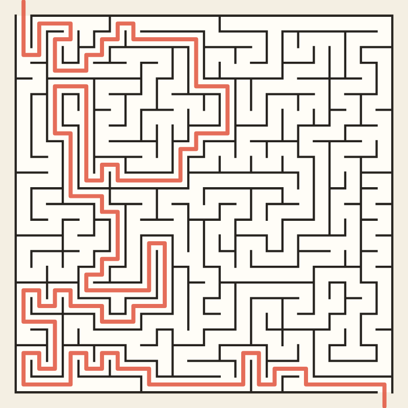
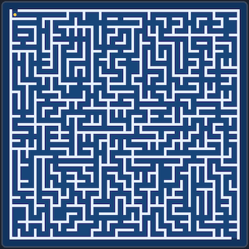
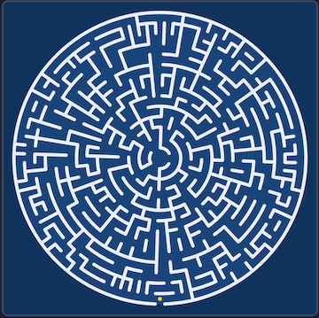
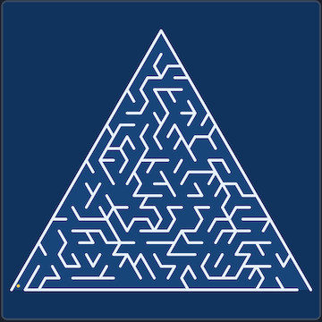
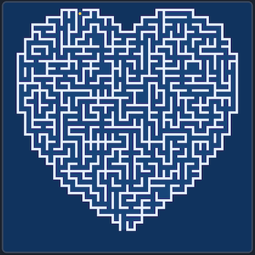

# Maze-Maker

Make a maze right in your browser: square, round, triangular or heart-shaped, with long winding corridors or a thicket of short dead ends. Then find your way through it with the arrow keys or a finger, or watch the solution draw itself, and save it as an SVG or a PNG, or print it. No sign-up and no libraries.

- [Make a maze](https://evoluteur.github.io/maze-maker/)

## What it does

A maze is a puzzle: it has branches and dead ends, and a way through. (A labyrinth has a single path and no choices; for those, see [Labyrinth-Maker](https://github.com/evoluteur/labyrinth-maker).)

- **Shapes**:
  - **Square**: a grid, entered at the top left and left at the bottom right.
  - **Circle**: rings of cells, entered from the outside with the goal at the center.
  - **Triangle**: a big triangle cut into small triangular cells, entered and left at the bottom corners.
  - **Heart**: a square grid cut to the shape of a heart, entered at the top of the left lobe and left at the tip.

  
  
  
  

  
- **Algorithms**: recursive backtracker, Prim, Kruskal, Wilson, Hunt & Kill, Growing Tree and Aldous-Broder. Each one gives mazes of a different texture.
- **Size and loops**: from 6 to 60 cells across. **Loops** opens a share of the dead ends, so there is more than one way through.
- **Solution length**: Any, Short, Medium or Long. The app makes a dozen mazes from the seeds that follow and keeps the one with the shortest, the middle or the longest way through.
- **Seed**: every maze comes from a number. The same settings and seed always give the same maze, and the page address keeps them, so a link brings back the same maze.
- **Solve it**: move with the arrow keys or WASD, or drag the dot. Backing up erases your trail. **Show solution** draws the shortest way through.
- **Look**: five color schemes (paper, blueprint, hedge, stone, night), wall thickness, and coloring by distance from the entrance.
- **Save**: **Download PNG** (2000 pixels square), **Download SVG**, or **Print** (black on white, maze only).

## How the mazes are made

Start with every wall standing, and knock walls down until every cell can be reached, but never so many that a loop appears: in graph terms, a spanning tree of the grid. The result is a perfect maze, with exactly one path between any two cells. The algorithms differ in the order they pick walls:

- **Backtracker** (depth-first search) carves as far as it can before backing up: long corridors, few dead ends.
- **Prim** grows the maze out from one cell: many short dead ends.
- **Kruskal** joins random regions anywhere on the grid: an even texture.
- **Wilson** uses loop-erased random walks, so every possible maze is equally likely.
- **Hunt & Kill** walks like the backtracker, but when stuck it hunts for a new cell next to the maze instead of backing up.
- **Growing Tree** grows from the newest cell half of the time and a random one otherwise: between the backtracker and Prim.
- **Aldous-Broder** is a pure random walk: the simplest, the slowest, and unbiased like Wilson.

The solution is found with a breadth-first search, which also gives each cell's distance from the entrance.

## How it is built

The pages are plain HTML, CSS and JavaScript, with no dependencies and no build step. Just open `index.html`. It is also a small installable web app: add it to your home screen or desktop and it works offline.

- The maze is one SVG, and all the geometry, the algorithms and the app logic are in [js/maze.js](https://github.com/evoluteur/maze-maker/blob/main/js/maze.js).
- Three color themes (dark, light and blue) are shared with my other projects.
- Your settings are kept in the browser's local storage.

Maze-Maker is open source at [GitHub](https://github.com/evoluteur/maze-maker) with MIT license.

Had fun browsing the app? [Buy me a coffee by becoming a sponsor](https://github.com/sponsors/evoluteur).

You may also be interested in my other projects [Labyrinth-Maker](https://github.com/evoluteur/labyrinth-maker) ([demo](https://evoluteur.github.io/labyrinth-maker/)), [Mandala-Maker](https://github.com/evoluteur/mandala-maker) ([demo](https://evoluteur.github.io/mandala-maker/)), [Harmonograph-Maker](https://github.com/evoluteur/harmonograph-maker) ([demo](https://evoluteur.github.io/harmonograph-maker/)) and [Sacred-Geometry](https://github.com/evoluteur/sacred-geometry) ([demo](https://evoluteur.github.io/sacred-geometry/)). For more mystic arts as small web apps, see [Esoterica](https://evoluteur.github.io/esoterica.html).

Copyright (c) 2026 [Olivier Giulieri](https://evoluteur.github.io/).
